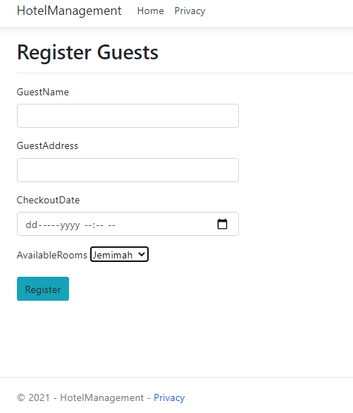

# HotelManagementSystem
This is a simple Hotel Management System that allows a guest to Check-in into a available rooms that are not occupied. It also takes into account the date and time a user checked in an out of the hotel. 

# Technologies 
- This project was built using C# and it targets ASP.NET Core 3.1 Framework. 
- This project was also built using the MVC Architecture pattern.
- The Database provider used is the Microsoft SQL Server Database which is a Relational Database.
- EF Core was used as the Object-Relational mapper.
- LINQ was used to query the DB sets.
- This project was implemented using the Repository Software Design Pattern.
- JQuery was also used  to prompt or alert the user that the guest has CheckedIn Successfully.

## Check the Diagram below for the Entity-Relationship Diagram.
This describes the relationship between the entities and the data model using cardialities.

## Project Documentation
- The Project has two Razor Views in the "Guest" Folder namely "RegisterGuestDetails.cshtml" which includes the form a use will fill to get a reservation in one of the available rooms and "ReturnForm.cshtml" which involves the view returned after successful checkedin.
- The Project also has three entity models namely GuestDetails.cs, Reservation.cs and HotelRoom.cs with their individual properties.
- The project has a controller named "GuestController.cs". This Controller has three action methods named "RegisterGuestDetails" which is an HttpGet request that returnd view RegisterGuestDetails to fill the Guest Form. The other action method has a similar name with the former but it's an HttpPost request that post form details to Database. The third action method name "ReturnForm" returns only a simple view.
- The project aslo contains a "GuestDetailsRepo.cs" that inherits an "IGuest" Interface. This Repository is a Data-Access Layer that contain methods that Add Guest Details to the Database(DB) and method that returns List of available rooms from the DB.

## Guest Details' Form

